# LearnMate Chrome Extension - Architectural Diagrams

## 🏗️ System Architecture Overview

### 1. High-Level System Architecture

### 2. Data Flow Architecture

### 3. Component Interaction Diagram

### 4. AI Processing Pipeline

### 5. Chrome Extension Architecture

```mermaid
graph TB
    subgraph "Chrome Browser Environment"
        subgraph "Extension Context"
            M[manifest.json]
            SW[Service Worker<br/>background.js]
            P[Popup<br/>popup.html + popup.js]
        end
        
        subgraph "Web Page Context"
            CS[Content Script<br/>content_script.js]
            CSS[Injected Styles<br/>inject_icon.css]
            DOM[Website DOM]
        end
        
        subgraph "Extension UI Components"
            FB[Floating Button 💬]
            CW[Chat Widget]
            PI[Popup Interface]
        end
    end
    
    subgraph "Content Processing"
        CE[Content Extractor]
        CP[Content Processor]
        CC[Context Compiler]
    end
    
    subgraph "Communication Layer"
        API[API Client]
        SSE[SSE Handler]
        ERR[Error Handler]
    end
    
    subgraph "Backend Services"
        BE[FastAPI Backend<br/>localhost:8000]
    end
    
    %% Extension Internal
    M --> SW
    M --> P
    M --> CS
    CS --> CSS
    CS --> DOM
    
    %% UI Components
    CS --> FB
    FB --> CW
    P --> PI
    
    %% Content Processing
    DOM --> CE
    CE --> CP
    CP --> CC
    
    %% Communication
    CW --> API
    PI --> API
    API --> SSE
    API --> ERR
    
    %% Backend Connection
    API --> BE
    SSE --> BE
    
    %% Permissions & Security
    M -.-> |activeTab| DOM
    M -.-> |scripting| CS
    M -.-> |storage| SW
    M -.-> |host_permissions| API
    
    %% Styling
    classDef extension fill:#e3f2fd
    classDef webpage fill:#f3e5f5
    classDef ui fill:#e8f5e8
    classDef processing fill:#fff3e0
    classDef communication fill:#fce4ec
    classDef backend fill:#f1f8e9
    
    class M,SW,P extension
    class CS,CSS,DOM webpage
    class FB,CW,PI ui
    class CE,CP,CC processing
    class API,SSE,ERR communication
    class BE backend
```

### 6. Backend API Architecture

### 7. Security & Data Flow

### 8. Deployment Architecture

### 9. User Journey Flow

### 10. Technology Stack Diagram

## 📊 Architecture Summary

### Key Architectural Principles

1. **Separation of Concerns**
   - Frontend handles UI and user interactions
   - Backend manages AI processing and data
   - External services provide AI capabilities

2. **Scalable Design**
   - Modular component architecture
   - Async processing for performance
   - Streaming responses for real-time experience

3. **Security First**
   - Minimal extension permissions
   - Secure API communication
   - Enterprise-grade AI infrastructure

4. **User Experience Focus**
   - Non-intrusive floating button
   - Real-time streaming responses
   - Context-aware assistance

### Technology Choices Rationale

| Component | Technology | Rationale |
|-----------|------------|-----------|
| **Frontend** | Vanilla JavaScript | Lightweight, no dependencies, fast loading |
| **Backend** | FastAPI | Modern Python framework, async support, auto-docs |
| **Vector DB** | FAISS | High-performance similarity search, proven at scale |
| **AI Models** | Gemini via Fuelix | Enterprise security, state-of-the-art capabilities |
| **Streaming** | Server-Sent Events | Real-time updates, browser native support |

### Performance Characteristics

- **Frontend Load Time**: < 100ms
- **Content Extraction**: < 200ms
- **AI Response Time**: < 500ms first token
- **Memory Footprint**: < 10MB browser, ~200MB backend
- **Concurrent Users**: Scalable via Fuelix infrastructure

### Security Features

- **Browser Sandbox**: Extension runs in isolated context
- **Minimal Permissions**: Only necessary browser permissions
- **Enterprise AI**: Fuelix provides enterprise-grade security
- **No Data Storage**: No personal data stored locally
- **Encrypted Transit**: All communications over HTTPS

---

*Generated from LearnMate Chrome Extension Technical Documentation*
*Architecture diagrams reflect the current system design and implementation*
